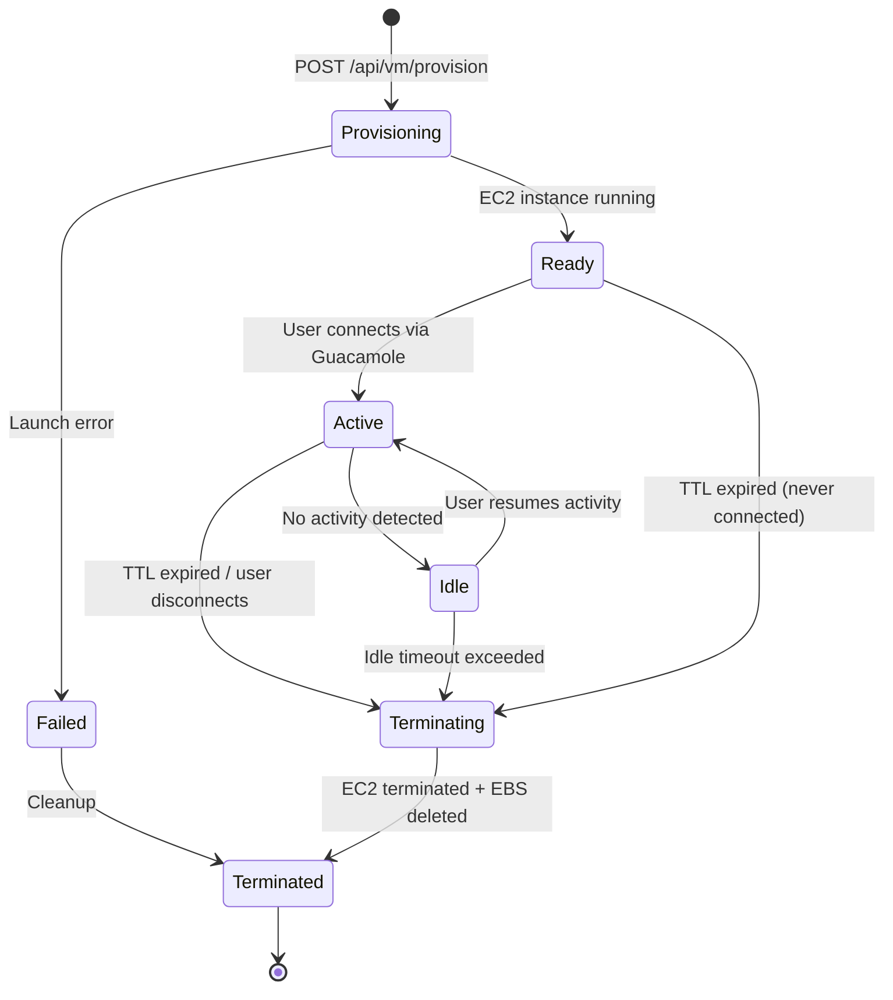
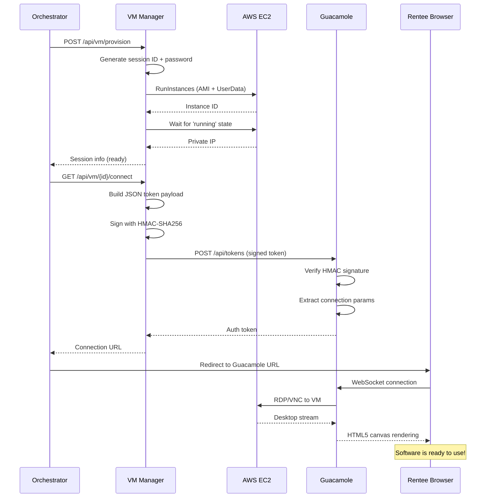
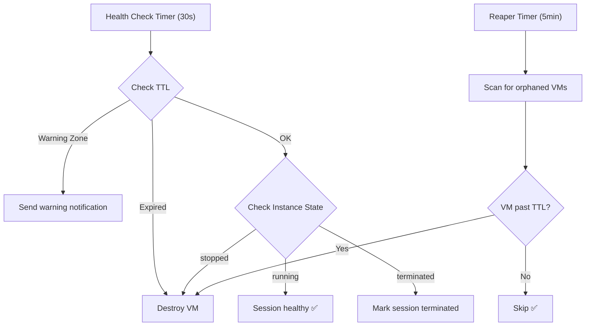

# VM Lifecycle Diagram

## State Machine

```mermaid
stateDiagram-v2
    [*] --> Provisioning : POST /api/vm/provision
    Provisioning --> Ready : EC2 instance running
    Provisioning --> Failed : Launch error
    Ready --> Active : User connects via Guacamole
    Active --> Idle : No activity detected
    Idle --> Active : User resumes activity
    Active --> Terminating : TTL expired / user disconnects
    Idle --> Terminating : Idle timeout exceeded
    Ready --> Terminating : TTL expired (never connected)
    Failed --> Terminated : Cleanup
    Terminating --> Terminated : EC2 terminated + EBS deleted
    Terminated --> [*]
```

## Provisioning Sequence

```mermaid
sequenceDiagram
    participant O as Orchestrator
    participant VM as VM Manager
    participant EC2 as AWS EC2
    participant G as Guacamole
    participant B as Rentee Browser

    O->>VM: POST /api/vm/provision
    VM->>VM: Generate session ID + password
    VM->>EC2: RunInstances (AMI + UserData)
    EC2-->>VM: Instance ID
    VM->>EC2: Wait for 'running' state
    EC2-->>VM: Private IP
    VM-->>O: Session info (ready)

    O->>VM: GET /api/vm/{id}/connect
    VM->>VM: Build JSON token payload
    VM->>VM: Sign with HMAC-SHA256
    VM->>G: POST /api/tokens (signed token)
    G->>G: Verify HMAC signature
    G->>G: Extract connection params
    G-->>VM: Auth token
    VM-->>O: Connection URL

    O->>B: Redirect to Guacamole URL
    B->>G: WebSocket connection
    G->>EC2: RDP/VNC to VM
    EC2-->>G: Desktop stream
    G-->>B: HTML5 canvas rendering
    Note over B: Software is ready to use!
```

## TTL Enforcement

```mermaid
flowchart TD
    A["Health Check Timer (30s)"] --> B{"Check TTL"}
    B -->|Expired| C["Destroy VM"]
    B -->|Warning Zone| D["Send warning notification"]
    B -->|OK| E{"Check Instance State"}
    E -->|running| F["Session healthy ✅"]
    E -->|stopped| C
    E -->|terminated| G["Mark session terminated"]

    H["Reaper Timer (5min)"] --> I["Scan for orphaned VMs"]
    I --> J{"VM past TTL?"}
    J -->|Yes| C
    J -->|No| K["Skip ✅"]
```
